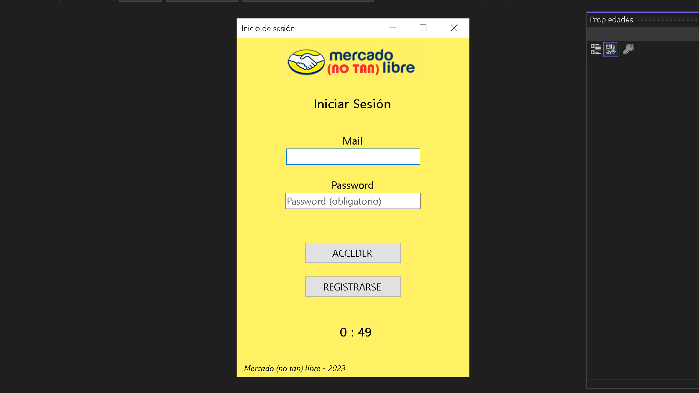
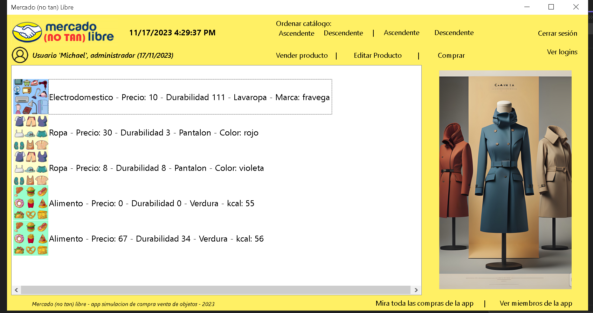
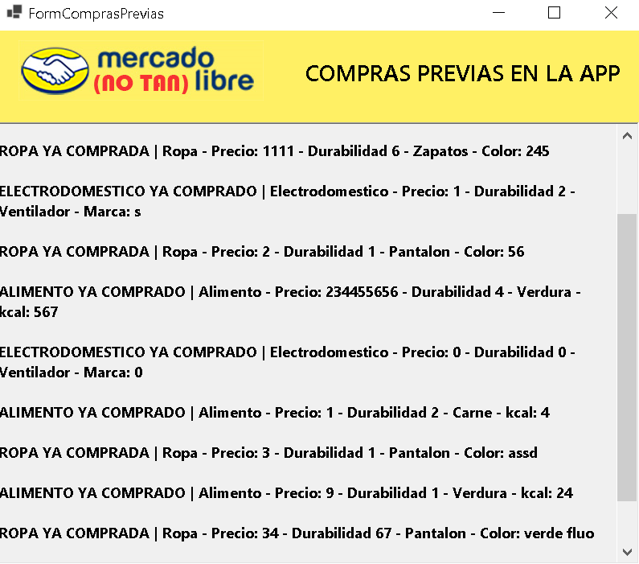
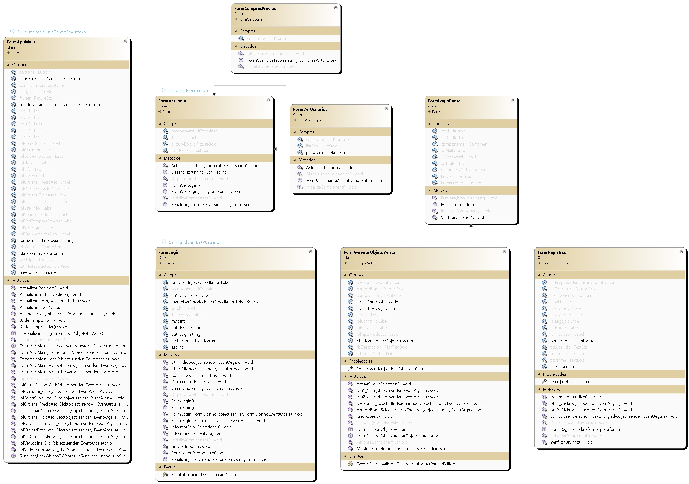
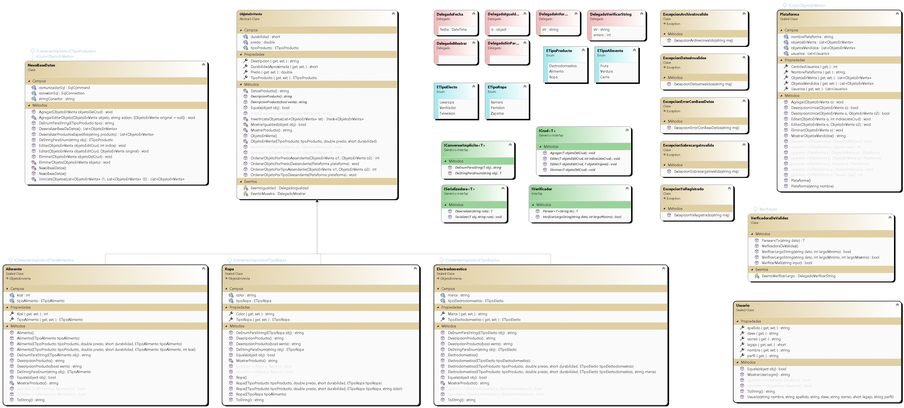
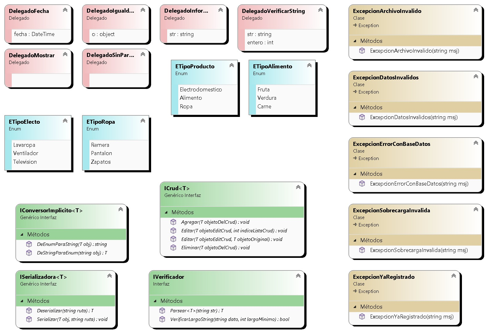
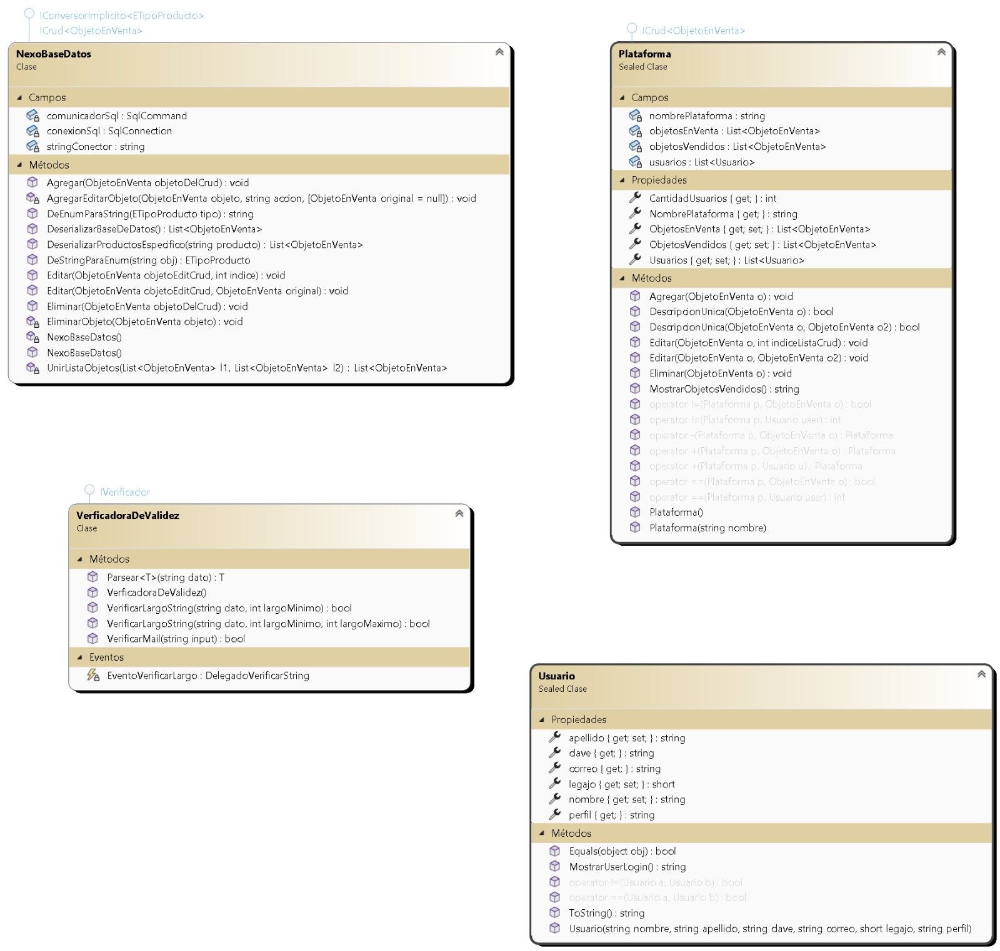
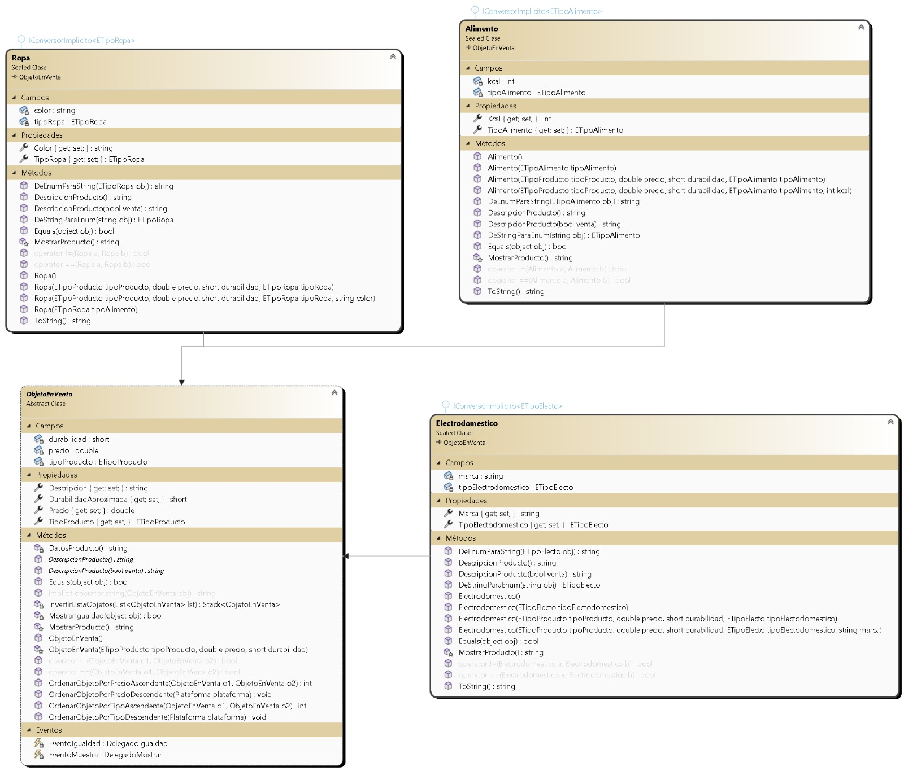

# Mercado (no tan) libre 
*App de simulacion compra/venta*

### Información del creador
Me llamo Mariano Guevara, al momento de realizar esta pequeña app (octubre-noviembre del 2023) tengo 18 años y me encuentro cerca de finalizar el 2do cuatrimestre de la carrera de programación en la UTN (Universidad tecnológica nacional) en el que usamos el lenguaje C#.

## ¿Qué hace la app?
#### Objetivo, descripcion.
Mercado (no tan libre), es una app 'parodia' de mercado libre, como bien se puede observar en el diseño. En ella el usuario se podrá registrar, y según su perfil, tendrá distintas funcionalidades específicas. 

La app por si misma cuenta con caracteristicas básicas como agregar un producto (pudiendo elegir entre 3 tipos distintos de ellos), modificar sus características, eliminarlos y verlos a todos agrupados en un 'catálogo de venta de productos'.

Ademas de estas funcionalidades generales, se podrán visualizar diferentes pestañas con pequeñas funcionalidades;
ver los miembros registrados en la app, ver todos los productos comprados previamente, ver los logins acumulados y ordenar el catalogo segun diferentes criterios.

##### Imagenes de la app: 

#### ¿Como se usa?
En cuanto al uso... La app en sí misma es muy intuitiva. Lo unico que se debe hacer es rellenar con datos segun corresponda en la pantalla, y de manera natural irá guiandote a las diferentes funcionalidades que se pueden utilizar como ya previamente mencioné, teniendo distintas
pantallas en las que aparecen datos interesantes, y pudiendo interacturar con el crud de manera correcta.

## Diagrama de clases:
#### Formularios:

#### Entidades general:

- #### Entidades Detalles:
- 
- 
- 